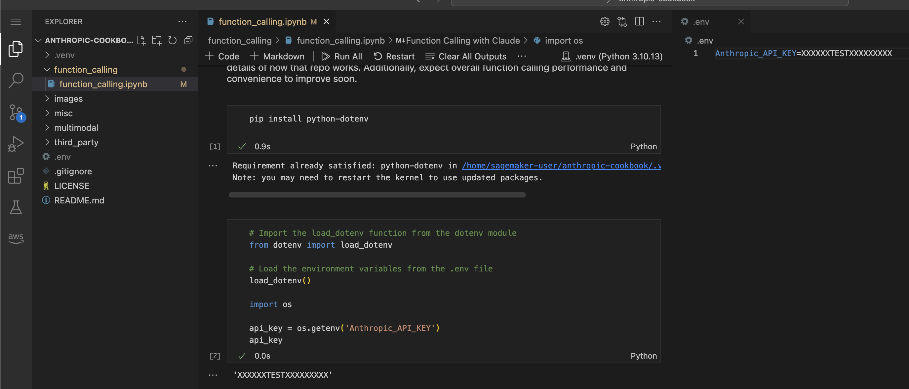

# VS CODE 노트북에서 환경 변수 사용하기
## (1) magical command 사용하는 방법
- 노트북 셀에서 아래와 같이 사용하시면, 사용하는 노트북에서 환경 변수를 사용할 수 있습니다.
```
%env api_key_test=XXXXapi_key_testXXXXX

import os

api_key = os.getenv('api_key_test')
api_key
# Output: 'XXXXapi_key_testXXXXX'
```

## (2) .env 를 사용하는 방법
- VS CODE 를 사용할시에는 아래 그럼처럼, 워크스페이스에 .env 파일을 생성하고, 원하는 환경 변수를 저장합니다.
- 그리고 아래의 코드 처럼, 환경 변수를 가져와 사용 하면 됩니다.
```
! pip install python-dotenv

# Import the load_dotenv function from the dotenv module
from dotenv import load_dotenv

# Load the environment variables from the .env file
load_dotenv()

import os

api_key = os.getenv('Anthropic_API_KEY')
api_key
```
