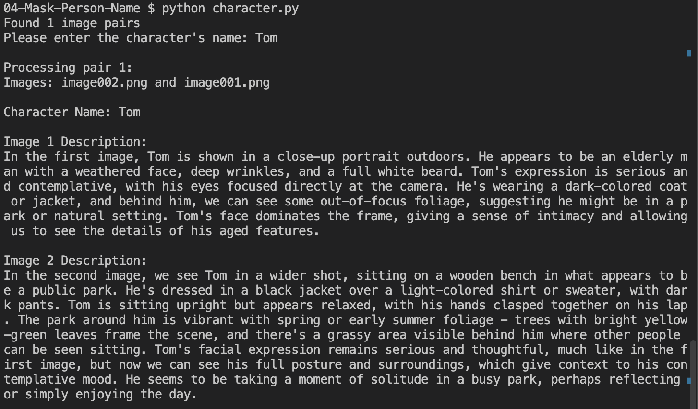

# 1. Problem Statement:

We pass the following 3 inputs to Claude:

- 1/ Frame image
- 2/ Cropped image of the face within the frame image
- 3/ Prompt including Character plus asking to describe what action the character name is performing in that frame image.

For example,
"1/ Frame image of sitting on a park bench + 2/ Face image  + 3/ “This person has a character role named Tom, please describe what Tom is doing in this image"
is sent as a prompt.

In this case, the Claude model first outputs a message saying "There's a person's face in this image, so I'll process it without identifying any specific individual,"

and then provides a result like the following:

- Expected result => Tom (character name) is sitting on a chair.
- Actual result => A person is sitting on a chair.
<p>

# 2. Solution:
## 2.1 method : Tool Use
## 2.2 Running Result

Character Name: Tom

Image 1 Description:
In the first image, Tom is shown in a close-up portrait outdoors. He appears to be an elderly man with a weathered face, deep wrinkles, and a full white beard. Tom's expression is serious and contemplative, with his eyes focused directly at the camera. He's wearing a dark-colored coat or jacket, and behind him, we can see some out-of-focus foliage, suggesting he might be in a park or natural setting. Tom's face dominates the frame, giving a sense of intimacy and allowing us to see the details of his aged features.

Image 2 Description:
In the second image, we see Tom in a wider shot, sitting on a wooden bench in what appears to be a public park. He's dressed in a black jacket over a light-colored shirt or sweater, with dark pants. Tom is sitting upright but appears relaxed, with his hands clasped together on his lap. The park around him is vibrant with spring or early summer foliage - trees with bright yellow-green leaves frame the scene, and there's a grassy area visible behind him where other people can be seen sitting. Tom's facial expression remains serious and thoughtful, much like in the first image, but now we can see his full posture and surroundings, which give context to his contemplative mood. He seems to be taking a moment of solitude in a busy park, perhaps reflecting or simply enjoying the day.

<p>

# 3. Experiment
## 3.1. How to run
- run setup.ipynb
- run character.py
    ```
    source activate base
    python character.py 
    ```
- Example
    - 